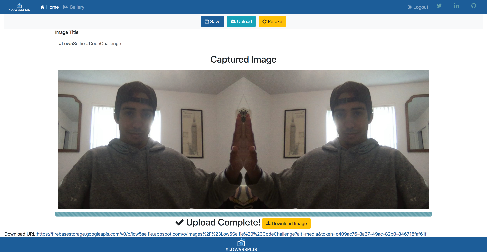

# Low 5 Selfie
A small application created with the idea of taking a Low 5 Selfie using Angular, Typescript, Express, NodeJS, and MongoDB

  

## Table of contents

- [Preview](#preview)
- [Programming Languages & Skills](#programming-languages-&-skills)
- [Setup and Installation](#setup-and-installation)
- [Dependences Used](#dependences-used)
- [Reference](#)

## Preview
Demo: https://low5selfie.web.app/

  

## Programming Languages & Frameworks

## Setup and Installation

1. Go into `low5selfie` run `npm install`
2. Go into `server` run `npm install`
3. Change MongoDB Connection String to your local MongoDB Cluster. String is located in `server\routes\api.js`.
4. Run `npm start` in both `low5selfie\` and `server\`

## Dependences Used

## References
